# 🏥 Care AI - Virtual Nurse Agent

## 📌 Project Overview
**Care AI** is a specialized **Behavioral Simulator** designed to act as a **Virtual AI Nurse**. 

While standard LLMs often sound robotic or overly generic when discussing health, Care AI has been fine-tuned to provide **empathetic, persona-aware medical guidance**. It dynamically adapts its tone—comforting a scared child, strictly advising an exhausted parent, or respectfully assisting an elderly patient—while adhering to safety protocols.

This project demonstrates the power of **PEFT (Parameter-Efficient Fine-Tuning)** to alter a model's *personality* and *bedside manner* without requiring massive compute resources.

---

## 🏗️ System Architecture

Unlike Retrieval-based systems (RAG) that focus on *finding facts*, this project focuses on **Style Transfer** and **Behavioral Adaptation**.

```mermaid
graph TD
    %% TITLE NODE
    Title["✨ Care AI - Nurse Agent Simulator Architecture ✨"]
    classDef titleStyle fill:#e1bee7,stroke:#4a148c,stroke-width:2px,font-size:20px,font-weight:bold,color:#000;
    class Title titleStyle;

    %% Define Styles
    classDef dataZone fill:#e3f2fd,stroke:#1565c0,stroke-width:2px;
    classDef trainZone fill:#f3e5f5,stroke:#7b1fa2,stroke-width:2px;
    classDef inferZone fill:#e8f5e9,stroke:#2e7d32,stroke-width:2px;

    %% ZONE 1: Data Pipeline
    subgraph "Phase 1: Behavioral Knowledge Ingestion"
        A[("Nurse-Patient Dataset<br/>(.jsonl)")] -- "Load" --> B["Preprocessing<br/>(Instruction + Input)"]
        B -- "Tokenize" --> C["Tokenized Data<br/>(Max Len: 512)"]
    end

    %% ZONE 2: Fine-Tuning (The Persona)
    subgraph "Phase 2: PEFT / LoRA Fine-Tuning"
        C -- "Feed" --> D["Base Model<br/>google/flan-t5-small<br/>(Frozen Weights)"]
        D -- "Inject" --> E["LoRA Adapters<br/>(Rank r=8, Alpha=32)<br/>Target: q, v"]
        E -- "Train (3 Epochs)" --> F["Saved Adapter<br/>./care_ai_model"]
        F --> G(["Result: Specialized 'Nurse' Weights"])
    end

    %% ZONE 3: Inference Engine
    subgraph "Phase 3: Empathetic Inference Engine"
        U["Patient Query<br/>(e.g., 'I missed my meds')"] -- "Input" --> H["Inference Wrapper<br/>care_ai_model()"]
        G -.-> H
        
        %% Detailed Sampling Logic
        H -- "Sampling (do_sample=True)" --> I["Temp: 0.7 (Creativity)"]
        I -- "Repetition Penalty: 1.5" --> J["Top-p: 0.9 (Focus)"]
        J -- "Generate" --> K(["Final Response:<br/>'Strict but Empathetic Advice'"])
    end

    %% Connect Title
    Title --- A

    %% Apply Styles
    class A,B,C dataZone;
    class D,E,F,G trainZone;
    class H,I,J,K,U inferZone;
```

---

## 📂 Dataset & Preprocessing
The model was trained on a curated dataset (`nurse_patient_conversations.jsonl`) consisting of diverse medical dialogues tailored for bedside manner.

### Data Structure
The model learns to map specific patient anxieties to professional nurse responses using the following schema:
* **Instruction:** System prompt defining the nurse's role and tone.
* **Input:** The patient's query (e.g., *"I'm scared of needles"*).
* **Output:** The ideal empathetic response (e.g., *"It's okay to feel that way. Let's take a deep breath together..."*).

---

## 📊 Training Results
| Metric | Value |
| :--- | :--- |
| **Total Runtime** | 4d 23h 38m (430,706 sec) |
| **Total Training Steps** | 9,375 |
| **Hardware Throughput** | 0.348 samples/sec |
| **Final Global Loss** | 1.646 |
| **Total FLOPs** | 2.80e+16 |

---

### ⏱️ Training Progression

---

## 🔑 Key Technical Implementations

### 1. Efficient Fine-Tuning (LoRA)
Instead of retraining the entire 80M parameter model, I used **LoRA (Low-Rank Adaptation)** to train only ~0.5% of the parameters, making the project lightweight and portable.
* **Target Modules:** `q` and `v` (Attention layers).
* **Performance:** Achieved domain adaptation in under 3 epochs on standard hardware.

### 2. Dynamic Inference Engine
A standard `model.generate()` call often produces robotic text. I built a custom inference wrapper `care_ai_model()` to enable **Human-Like Variety**:
* **Sampling (`do_sample=True`):** Allows the model to choose from a pool of likely words rather than just the mathematical top choice.
* **Temperature (0.7):** Tuned to balance professional accuracy with conversational warmth.
* **Repetition Penalty (1.5):** Prevents the model from looping phrases, a common issue in medical LMs.

---

## 📊 Performance: Scenario Testing
The model was stress-tested against distinct patient personas to verify its adaptive capabilities:

| Patient Persona | Query Scenario | AI Nurse Response Strategy |
| :--- | :--- | :--- |
| **🥺 Scared Child** | "My tummy hurts... I'm scared of shots." | **Gentle & Simple:** Uses soft language, reassures the child, avoids jargon. |
| **😰 Anxious Adult** | "Is this headache a brain tumor??" | **Calm & De-escalating:** Validates anxiety but pivots to objective symptom checking. |
| **💊 Chronic Patient** | "I missed my meds, should I double dose?" | **Strict & Safe:** Immediately warns against double-dosing; prioritizes safety. |
| **👵 Elderly Patient** | "I'm just a bit short of breath, dear." | **Respectful & Vigilant:** Uses polite address but recognizes serious medical signs. |

---

## 🛠️ Tech Stack
* **Model:** `google/flan-t5-small` (Seq2Seq Transformer)
* **Fine-Tuning:** Hugging Face `peft` (LoRA), `transformers`
* **Training:** PyTorch Trainer API
* **Data Handling:** `datasets`, `pandas`
* **Visualization:** `matplotlib` (for loss curves)

---

## 🚀 Future Scope
* **Guardrails:** Implement NeMo Guardrails to block non-medical queries.
* **Voice Interface:** Add Speech-to-Text (Whisper) to allow elderly patients to speak directly to the app.

---

## 👨‍💻 Author
**Sagar Sidhwa**
* **AI / ML Engineer**
* **Education:** MS in CS (AI Track) — Binghamton University
* *Focusing on AI/ML LLM and end-to-end real-world projects. Open to collaboration!*
