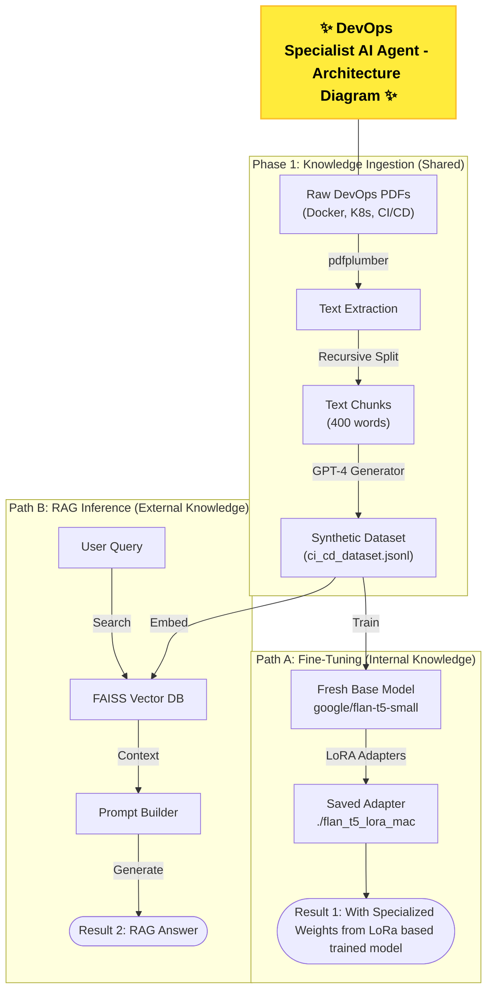

# ⚡ DevOps Specialist AI Agent - CI/CD Pipeline Insight Engine

## 📌 Project Overview
This project builds a specialized **AI Agent** designed to answer complex technical questions regarding **DevOps, CI/CD, Docker, and Kubernetes**. 

It implements a **dual-path architecture** to maximize accuracy:
1.  **Fine-Tuning:** A "Specialist" model trained on domain-specific data using **LoRA (Low-Rank Adaptation)**.
2.  **RAG (Retrieval-Augmented Generation):** A "Librarian" pipeline using **FAISS** vector search to provide grounded, factual evidence.

The system combines the reasoning of a **fine-tuned Flan-T5-small** LLM with the factual depth of a vector database to eliminate hallucinations in technical documentation.

---

## 🎯 Objectives
- Build a **domain-specific RAG pipeline** for DevOps Q&A.  
- Store curated knowledge in a **vector DB** for semantic similarity search.  
- Use a **lightweight LLM (Flan-T5-small)** for refining retrieved results.  
- Demonstrate an **end-to-end workflow** for deploying intelligent CI/CD assistants.
- **Domain Specialization:** Fine-tune a lightweight model to understand DevOps terminology (e.g., "pods," "pipelines," "rolling updates").
- **Factual Accuracy:** Implement RAG to retrieve exact documentation snippets for every answer.
- **Efficiency:** Demonstrate that a small model (~80M params) can outperform larger generic models when correctly fine-tuned with **PEFT/LoRA**.

---

## 📁 Dataset & Data Processing

This project utilizes a custom technical dataset located in the `DevOps Dataset` folder of this Repo/Project folder.

### Data Source
The dataset consists of technical manuals and documentation (PDFs) covering:
* **CI/CD Pipelines** (Jenkins, GitLab CI)
* **Containerization** (Docker)
* **Orchestration** (Kubernetes)

### Data Engineering Pipeline
Instead of using raw text, I implemented a robust ETL pipeline:
1.  **Extraction:** Used `pdfplumber` to extract raw text from PDF manuals.
2.  **Chunking:** Split text into **400-word segments** to maintain context.
3.  **Synthetic Pair Generation:** Leveraged **GPT-4** to convert raw chunks into high-quality **Instruction-Input-Output** JSONL pairs for supervised fine-tuning.

---

## 🏗️ System Architecture

The project follows a dual-path workflow: **Internal Knowledge (Fine-Tuning)** vs. **External Knowledge (RAG)**.



## 🔑 Steps Followed
1. Dataset Preparation – converted PDFs into JSONL (instruction, input, output).  
2. Embedding Generation – used `all-MiniLM-L6-v2` to embed only the `output` field.  
3. Vector DB Setup – stored embeddings + metadata in **FAISS**.  
4. Retrieval – implemented top-k nearest neighbor search.  
5. LLM Integration – used `google/flan-t5-small` to refine retrievals.  
6. RAG Pipeline – ensured:
   - If DB has answer → refine & optimize.  
   - If DB incomplete → generate missing details.  
7. Evaluation – tested queries across CI/CD, Docker, Kubernetes docs.

---

## 📊 Example Queries
```text
What is Continuous Integration (CI) in Agile?
List the benefits of using Docker in CI/CD.
How does a Kubernetes Deployment manage scaling?
What challenges exist in securing CI/CD pipelines in the cloud?
Explain CI/CD pipeline in data engineering.
```

---
## 🛠️ Tech Stack

This project is built using the following technologies and frameworks:

* **Python**: The core programming language used for the entire project.
* **Transformers**: Utilized to access pre-trained language models and tokenizers from Hugging Face.
* **PyTorch**: A deep learning framework used to train and run the models.
* **FAISS**: An open-source library for efficient similarity search of the high-dimensional vectors.
* **Sentence-Transformers**: A specialized library used to generate the dense vector embeddings of text.
* **LLM: `google/flan-t5-small`**: A small, fine-tuned language model used for various natural language processing tasks, such as generating responses.
* **Embeddings: `all-MiniLM-L6-v2`**: A compact and efficient model for converting text into numerical vectors for semantic search.
* **Vector DB: FAISS**: Used as a vector database to store and quickly retrieve text embeddings.
* **Notebook: Jupyter**: The primary environment used for experimentation and development.

---

## 👨‍💻 Author
**Sagar Sidhwa**
* **AI / ML Engineer**
* **Education:** MS in CS (AI Track) — Binghamton University
* *Focusing on ML and end-to-end real-world projects. Open to collaboration!*
