# 🖼️ Photo Vision - Context-Aware Image Editing Image Classifier & Adaptive Enhancer

## 📖 Project Description
**Photo Vision** is an intelligent, **Context-Aware Image Editing Classifier & Adaptive Enhancer**.

A deep learning-powered system that classifies images into specific context categories (Documents, Nature, Food, Low-Light) and applies **adaptive image enhancement** algorithms to solve specific visual problems.

Most photo editors apply generic filters blindly. This project builds an AI that first **"understands"** the image content using Deep Learning, and then automatically triggers the **correct** mathematical enhancement algorithm.

The system combines **Image Classification** (to identify the scene) with **Adaptive Enhancement** (to fix specific problems), moving beyond static recognition to enable **dynamic, context-aware image optimization**.

---

## 🏗️ System Architecture

The system operates in three distinct phases: **Recognition (The Eye)**, **Decision (The Router)**, and **Enhancement (The Artist)**.

```mermaid
graph TD
    %% TITLE NODE
    Title["✨ Photo Vision - Context-Aware Image Editing ✨"]
    classDef titleStyle fill:#fff,stroke:#333,stroke-width:0px,font-size:20px,font-weight:bold;
    class Title titleStyle;

    %% Define Styles
    classDef input fill:#e3f2fd,stroke:#1565c0,stroke-width:2px;
    classDef modelZone fill:#f3e5f5,stroke:#7b1fa2,stroke-width:2px;
    classDef routerZone fill:#fff9c4,stroke:#fbc02d,stroke-width:2px;
    classDef cvZone fill:#e8f5e9,stroke:#2e7d32,stroke-width:2px;
    classDef output fill:#ffe0b2,stroke:#f57c00,stroke-width:2px;

    %% INPUT
    Img[("📸 Input Image<br/>(Raw)")]:::input
    Pre["Preprocessing<br/>(Resize 224x224, Rescale)"]:::input
    
    %% Connect Title
    Title --- Img
    Img --> Pre

    %% PHASE 1: THE "BRAIN" OPTIONS
    subgraph "Phase 1: Deep Learning Architectures"
        direction TB
        
        %% WAY 1
        subgraph "Strategy A: Transfer Learning"
            TL_Base["EfficientNetB0<br/>(Frozen Backbone)"]:::modelZone
            TL_Head["Custom Dense Head<br/>(GlobalAvgPool + Dense)"]:::modelZone
            TL_Base --> TL_Head
        end

        %% WAY 2
        subgraph "Strategy B: Fine-Tuning"
            FT_Base["EfficientNetB0<br/>(Unfreeze Last 60 Layers)"]:::modelZone
            FT_Head["Re-Compiled Head<br/>(LR: 1e-5)"]:::modelZone
            FT_Base --> FT_Head
        end

        %% WAY 3
        subgraph "Strategy C: Custom CNN"
            CNN_Block1["VGG-Style Blocks<br/>(32-64 Filters)"]:::modelZone
            CNN_Block2["Deep Blocks<br/>(128-256 Filters)"]:::modelZone
            CNN_Head["Classifier<br/>(Dense 512 + Dropout)"]:::modelZone
            CNN_Block1 --> CNN_Block2 --> CNN_Head
        end
    end

    %% CONNECTING INPUT TO MODELS
    Pre -.-> TL_Base
    Pre -.-> FT_Base
    Pre -.-> CNN_Block1

    %% PREDICTION CONVERGENCE
    Pred(["🎯 Predicted Class Label"])
    TL_Head --> Pred
    FT_Head --> Pred
    CNN_Head --> Pred

    %% PHASE 2: ROUTER
    subgraph "Phase 2: The Router"
        Router{"Check Context"}:::routerZone
        Pred --> Router
    end

    %% PHASE 3: ENHANCEMENT
    subgraph "Phase 3: Adaptive Enhancement"
        Route1["If 'Document'"]:::cvZone
        Route2["If 'Low Light'"]:::cvZone
        Route3["If 'Food / Nature'"]:::cvZone
        
        Router --> Route1
        Router --> Route2
        Router --> Route3

        Alg1["📝 Text Optimization<br/>(Adaptive Thresholding)"]:::cvZone
        Alg2["💡 Smart Brightening<br/>(Gamma Correction)"]:::cvZone
        Alg3["🎨 Vibrance Boost<br/>(HSV Saturation Scale)"]:::cvZone

        Route1 --> Alg1
        Route2 --> Alg2
        Route3 --> Alg3
    end

    %% OUTPUT
    Final[("✨ Context-Aware Result")]:::output
    Alg1 --> Final
    Alg2 --> Final
    Alg3 --> Final
```

## 📂 Dataset (Link - https://people.ee.ethz.ch/~ihnatova/camsdd.html)
The model was trained on the **CamSDD (Camera-Based Document Layout Dataset)** and augmented classes.
* **Source:** CamSDD - ETH Zurich - (`https://people.ee.ethz.ch/~ihnatova/camsdd.html`)
* **Structure:** Images sorted into context categories including Documents, Nature, Food, and Low-Light environments.

---

## 🧠 Phase 1: The "Brain" (Model Training Strategies)
I implemented and compared three different Deep Learning strategies to find the optimal classifier for document-centric tasks:

| Strategy | Technique | Result |
| :--- | :--- | :--- |
| **Transfer Learning** | Pre-trained **EfficientNetB0** (ImageNet weights) as a frozen feature extractor. | Fast training, moderate accuracy. Good for general object detection. |
| **Two-Stage Fine-Tuning** | 1. Train top layers. 2. Unfreeze last 60 layers of backbone with a low LR (`1e-5`). | **Best Performer.** Highest accuracy; learned textures like paper grain vs. flat color. |
| **Custom CNN** | Built a 4-block Deep CNN with `BatchNormalization` and `Dropout`. | Effective but required significantly more epochs to converge. |

---

## 🎨 Phase 2: The "Artist" (Adaptive Enhancement)
The system moves beyond simple classification by applying tailored image processing pipelines based on the detected context:

| Detected Context | The Problem | The Solution (Algorithm) |
| :--- | :--- | :--- |
| **📄 Documents** | Shadows, low contrast, gray background. | **Adaptive Thresholding + Sharpening:** Forces background to white and text to black for OCR readiness. |
| **🌑 Low Light** | Subject is hidden in shadows or backlit. | **Gamma Correction:** Non-linearly brightens dark pixels while preserving bright details. |
| **🍔 Food / Nature** | Colors look flat or unappetizing. | **HSV Vibrance Boost:** Scales 'Saturation' channel in HSV space for natural color popping. |

---

## 📈 Results
* **Baseline CNN:** Moderate accuracy; struggled with complex lighting conditions.
* **Transfer Learning (EfficientNet):** Achieved a significant accuracy improvement of **>90%**.
* **Adaptive Enhancement:** Demonstrated meaningful improvements in image utility—documents became readable, and low-light photos regained visibility.

---

## ⚙️ Tech Stack
* **Languages:** Python 3.10+
* **Deep Learning:** TensorFlow, Keras (Functional & Sequential APIs)
* **Computer Vision:** OpenCV (`cv2`), PIL
* **Data Pipeline:** `tf.data.AUTOTUNE` (Caching & Prefetching)
* **Visualization:** Matplotlib, Seaborn

---

## 👨‍💻 Author
**Sagar Sidhwa**
* **AI / ML Engineer**
* **Education:** MS in CS (AI Track) — Binghamton University
* *Focusing on AI/ML LLM and end-to-end real-world projects. Open to collaboration!*
